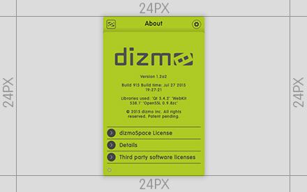

# (Display Name of the dizmo)

**Table of contents**

1. Screenshots
2. Description
3. What is new in VX.Y.Z
4. Works well with
5. Additional information

## Screenshots

Add your screenshots measuring width 400 px and height 275 px that illustrate your dizmo.

## Description

Describe what can be done with the dizmo and how it should be used.

## What is new in VX.Y.Z

Explain the improvements of the newest dizmo, then list those of each published version.

## Works well with

(Optional) List the hardware and/or the dizmos with which your dizmo can be used.

## Additional Information

* Developer: (Developers Name)
* Publisher: (Publisher's Name, remove if same as Developer)
* Contact: (Who to contact for additional information or support)
* Website: (URL of the dizmo providing additional information)
