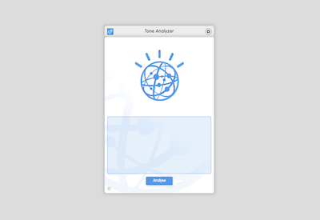
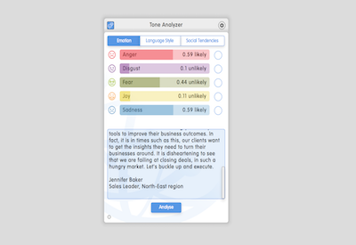

# Tone Analyzer

## Screenshots

## Description

Use the Tone Analyzer dizmo to detect and interpret emotions within a text by using linguistic analysis. Tones such as joy, fear, sadness, anger and disgust can be detected. Language style and social tendencies can also be analysed. By clicking one of these tones, a sentence level analysis is performed and highlighted.

## Initial version v1.0

* Analyse Emotion, Language style & Social Tendencies

## Works well with

Dock the Tone Analyzer dizmo with
* Sticky Notes
* IBM Newsletter

## Additional Information

* Developer: dizmo AG 
* Contact: support@dizmo.com 
* Website: [www.dizmo.com](https://www.dizmo.com) 

